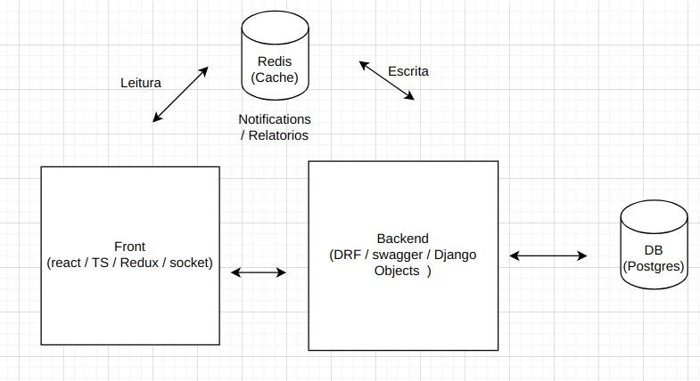
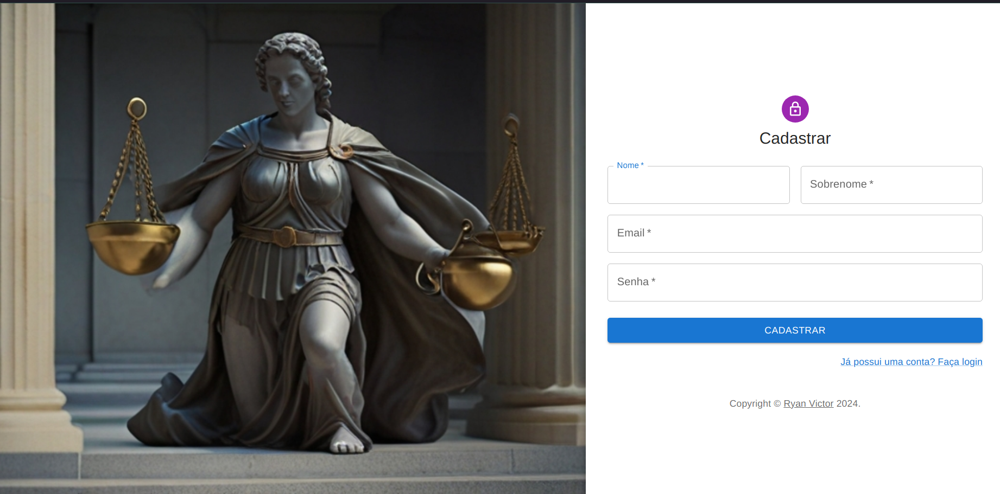
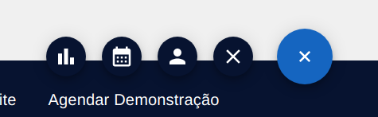
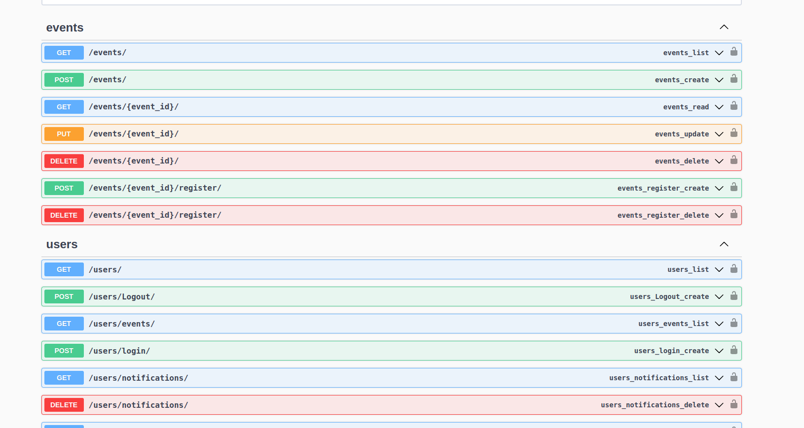

# Teste Prático da empresa FreeLaw

## Planejamento Geral:




### Ideias principais do projeto:

- Ter um Front separado do backend 
- Usar React e Ts no front, oferecendo uma interface Reativa
- Usar um Backend em DRF de acordo com os requisitos
- Usar o Postgres como SQL database
- Ter um banco de cache para relatórios e notificações, sendo escrito pelo back e lido pelo Front.

**O front mandaria uma requisição pesada para o back -> eu separaria essa requsição em uuma tread paralela -> processaria esses dados -> salvaria no banco de cache -> se houvesse alteração nos dados e outro relatório fosse requirido, eu limparia o cache e salvaria lá de novo.**

_a Ideia era fazer isso tudo em 4 dias, mas na prática, não deu para fazer tudo. Eu preferi entregar incompleto para não prejudicar outros candidatos. (o banco de cache mesmo não implementei.)_

## Como rodar o projeto passo a passo:

- Tenha o Docker instalado na sua maquina, caso não tenha, pode baixa-lo aqui: [Download Docker](https://www.docker.com/#build)
- Na raiz:
- - Vai ter um arquivo `docker-compose.yml`, basta abrir um terminal e digitar:

````bash
sudo docker compose up --build 
````
(isso vai buildar toda a nossa applicação. O back o front e o banco SQL.)

**Importante: Antes entrar no sistema, faça mais 2 comandos: (em outro terminal)**

```bash
docker ps
```
(isso vai listar todos os containers que você tem rodando, pegue o ID do container e execute:)

**Rode As migrations com este comando:**
```bash
docker exec -it id-do-container-django python manage.py migrate
```

**Agora o nosso sistema estará estará aqui: [FreeLaw Teste](http://localhost:3000/)**
(_Certifique-se que nada esta rodando na porta 3000, 8000 ou 5435_)

Se tudo deu certo até aqui, você vaii ver essa página:


clique em não "tenho conta" ->


Crie sua conta, salve suas credenciais e pode entrar no sistema com o login.


#### Açoes do site:
- você pode criar um novo usuário, no dial `(+)` que aparece abaixo.

(events/)


- Você pode criar/editar um evento no mesmo dia.
- você pode excluir, se inscrever e editar o evento pelo card do evento (primeiro precisa criar um evento no dial)

**Apos Criar um evento, se inscrever nele, e edita-lo, verá o sistema das notificações em ação.**
O socket recebe esse sinal e atualiza a lista na hora.

(Basta clicar nas notifiicações para exibir a lista delas e escolher qual apagar)

ps: O Processamento de queries pesadas / relatórios, acontece em uma tread paralela, que é excluida após o processamento.

#### Pontos Fracos do projeto:
- Não deu tempo de implementar o banco de cache
- - como seria:
- - Após clicar em gerar um relatório, o back receberia essa task, processaria em background e guardaria no cache (redis)
- - (guardaria filtros específicos em variaveis no redis) 
- - se solicitado outro filtro, faria a mesma coisa. Solicitado o mesmo, pegaria do cache e nao faria requisição para o back.
- - houve alterações no evento? resetaria o banco de cache e reiniciaria o fluxo.
- Não implementado o crud completo de usuarios
- Não limpei o código
- Pouco tempo (Obrigado pelo tempo extra)

#### Pontos Fortes:
- Fiz em 4 dias
- Implementei o redux
- Entendi bem a regra
- Boa documentação dos endpoints, onde é possivel fazer boas integrações- [hhtp://localhost:8000/swwager/]() 
- testes unitários
- fullstack
- Dockerizado
- websoockets e django channels 
- validação de cors
- e mais!
#### Endpoints do swweager:


### PS: Se tivesse mais tempo, esse projeto ficaria perfeito, eu juro!

#### Dúvidas? 
[Meu Linkedin](https://www.linkedin.com/in/ryan-victor-alves/)
